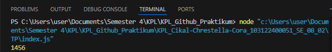

Soal

Kamu sudah menulis fungsi mulOfArray. Ujilah dengan input [2, 0, 26, 28, -2], dengan output yang seharusnya adalah 1456. Jika kamu menemukan bahwa hasilnya berbeda, bisakah kamu memperbaikinya? Jika kamu menemukan bahwa hasilnya sama, bisakah kamu menjelaskan mengapa demikian?

Kode Sumber 

Tersedia di [index.js](index.js)

Output 

hasilnya langsung sesuai 1456 tidak 0 dikarenakan kodenya yang sudah benar

kode : if (arr[i] > 0) { result *= arr[i] }

disini menggunakan lebih besar [ > ] bukan lebih besar samadengan [ >= ] sehingga hasilnya sesuai